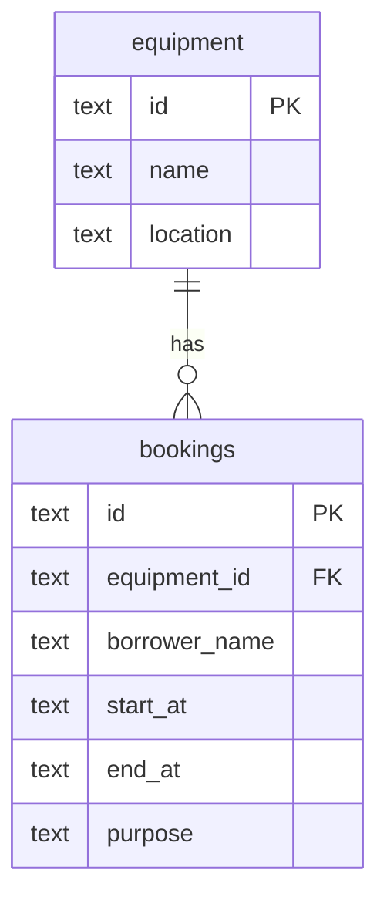

# Campus Equipment Booking API (Hono + D1)

## Run
```
npm install
npx wrangler d1 execute booking-db --local --file=schema.sql
npx wrangler dev
```
Base URL: http://localhost:8787/api

** Deployed API**:

```
https://booking-api.setthawut.workers.dev/api

## Test
```
bash test.sh 2>&1 | tee TEST_EVIDENCE.md
```

## Schema / ERD



See schema.sql for the full DDL.

## Files
API_CONTRACT.md, AI_LOG.md, QUALITY_GATE_REVIEW.md, TEST_EVIDENCE.md,schema.sql
